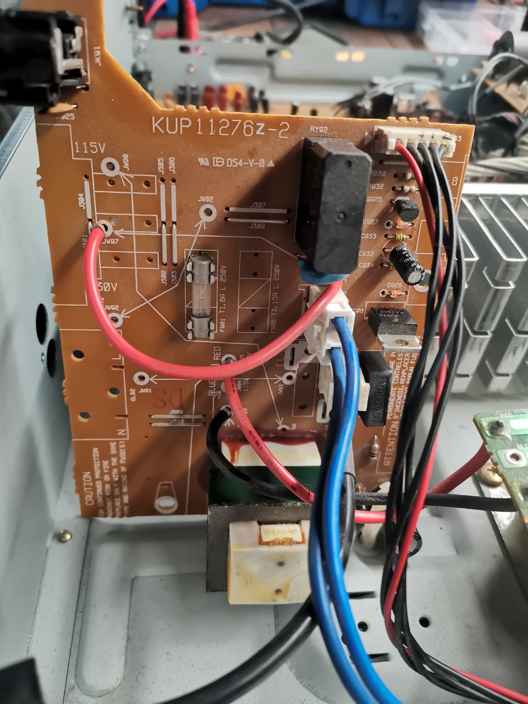
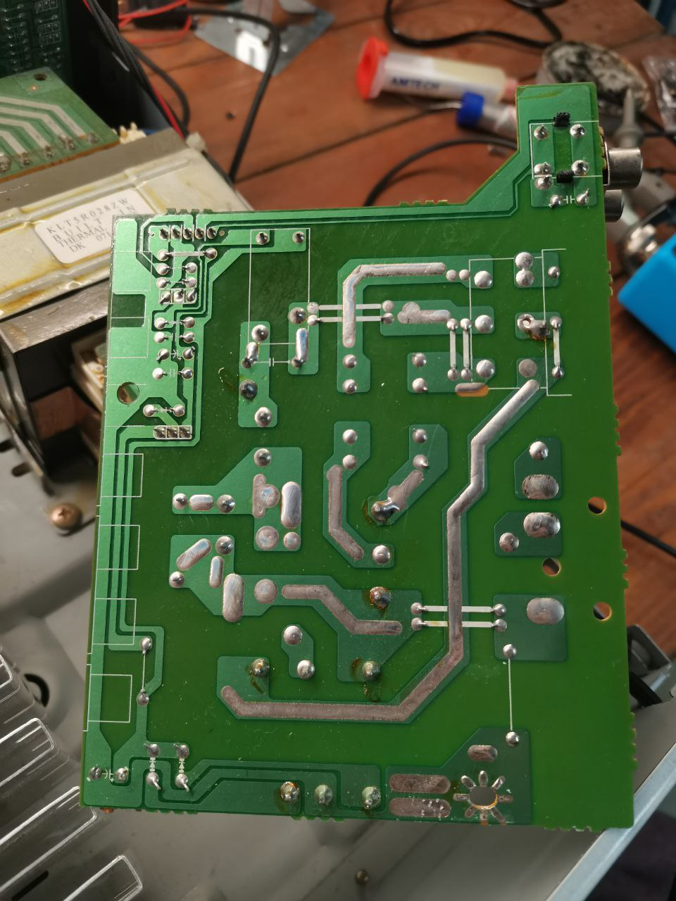
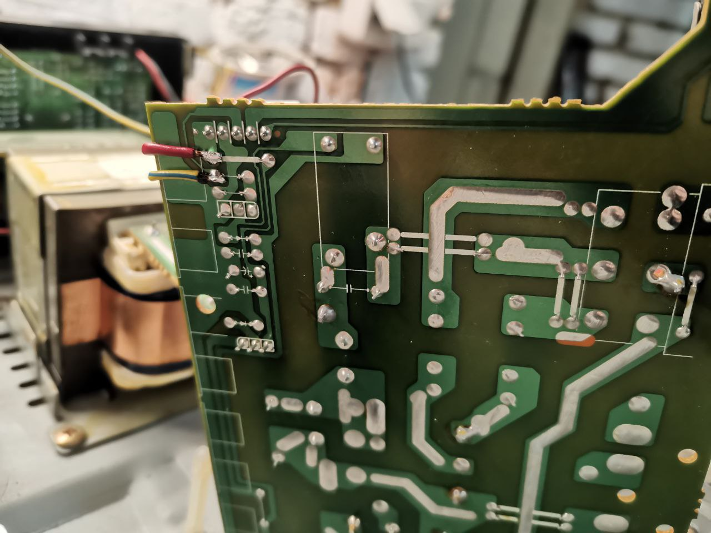
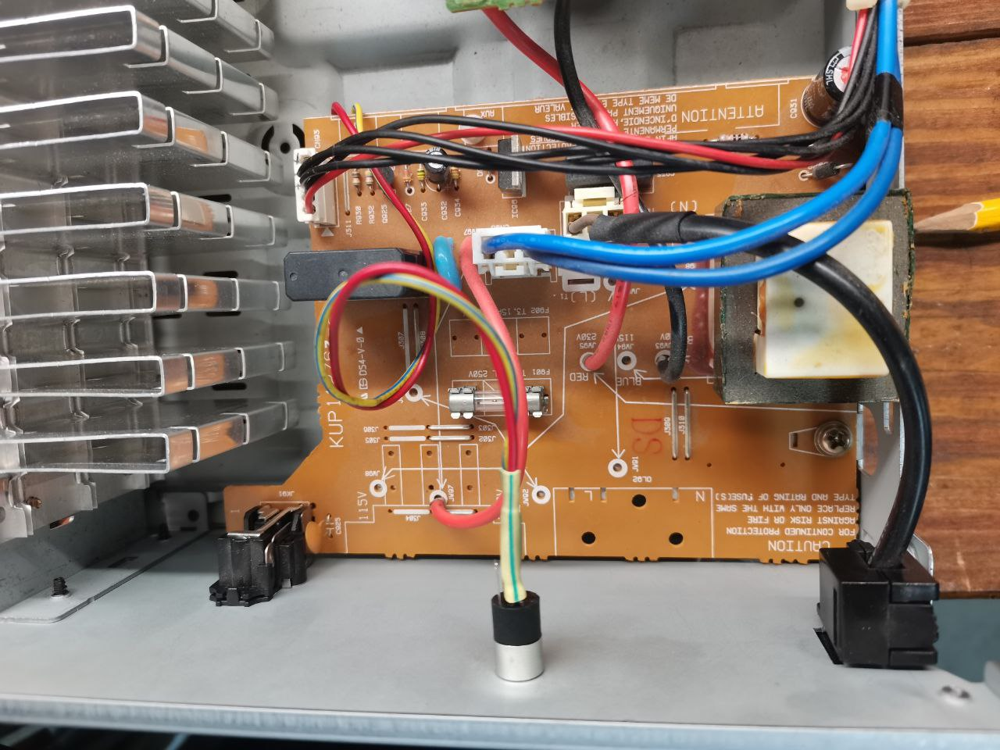
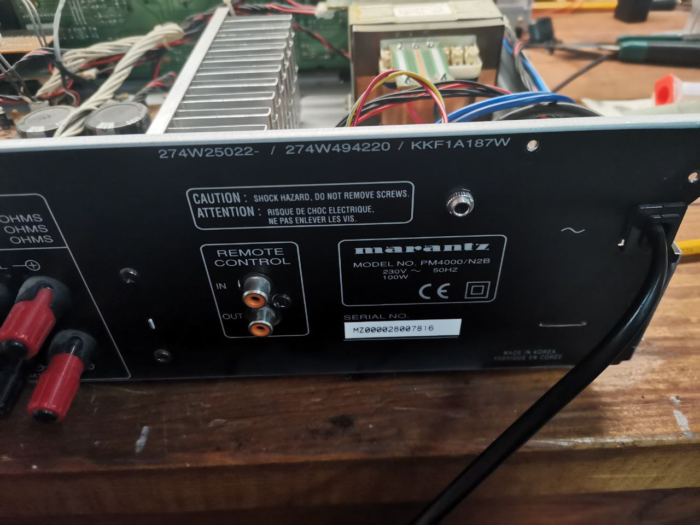

# Miscellaneous

## Marantz RC5 IR-remote codes

[Link to Excel sheet](Marantz%202014%20IR%20Command%20Sheet.xls)

## NodeMCU ESP8266 board pinout

## Circuit diagram

[Link to the diargram in CDDX format](circuit.cddx).
Created in https://www.circuit-diagram.org

## Additional hardware connections

1. Power supply board

2. Power supply board bottom trace

3. IC power +5V and power relay lines

4. Additional 3.5 Jack installed

5. Back side with jack added

