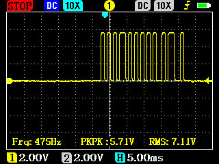
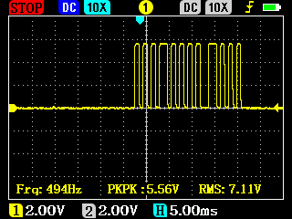
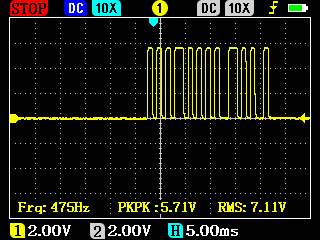
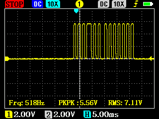
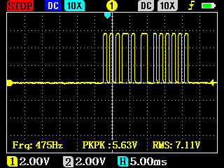
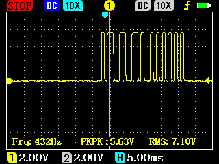
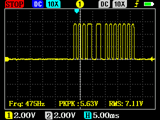
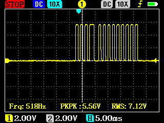
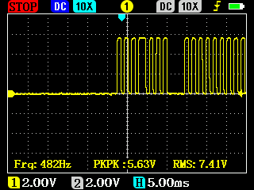

## Marantz RC5 IR-remote codes table

[Link to Excel sheet](Marantz%202014%20IR%20Command%20Sheet.xls)

## Here is some examples of how RC5 signals look

### Mute: address - 16, command - 13

### Volume Up: address - 16, command - 16

### Volume Down: address - 16, command - 17

### Input tuner: address - 17, command - 63

### Input tape: address - 18, command - 63

### Input CD: address - 20, command - 63. Toggle bit Low!

### Input phono: address - 21, command - 63

### Input CD-R/MD: address - 23, command - 63

### RC5 extended. Shows pause in transmission after address

